# Laboratorio BigData
# ST0263 Tópicos especiales en telemática 

# Mateo Flórez Restrepo
# 2020-1

### Contenidos del laboratorio
* Creacion y gestion de archivos en EMR

* Gestion de archivos en HDFS Y S3

* Map/Reduce 

* Ejercicio Map/ Reduce con MRJob

* Gestion de datos hive/sqoop 

* Caso de estudio Retail_db

* Spark ejecución, Jupyter Notebooks

* Lab estudio COVID_19

# Bitácora

### 1. Creacion y gestión de archivos en EMR 

* Creación del cluster

  Ingresamos a nuestra cuenta AWS Educate e ingresamos a la consola de AWS.
  
  Creamos una KeyPair que ira asociada con el cluster
  
   

  Cluster por método interactivo:
  
  Buscamos a EMR en la consola, y creamos un nuevo cluster.
  
  Recursos:
  
   
  
  Cluster creado:
  
  
  
   
  
  Se agrega las reglas para los puertos pertenecientes a Hue(8888) a Zeppelin(8890) y SSH(22)
  
   
  
  Luego vamos a la seccion de Bloqueo de acceso publico y agregamos el rango de puertos de usaremos para este laboratorio.
  
    
  
  # Scripts importantes para creacion y destruccion de clusters
  
    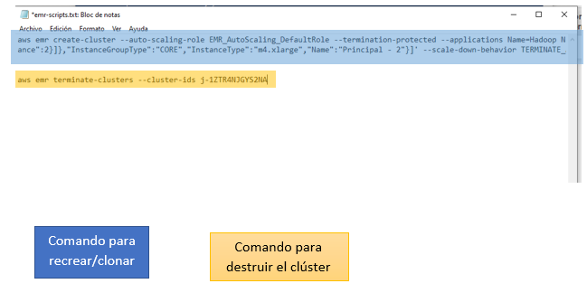 

* Destrucción de un cluster
  
  Interactivamente:
  
  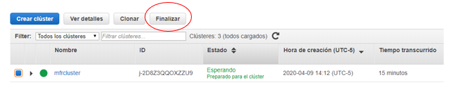
  
  Por línea de comandos:
  
    1.	Actualizamos las credenciales de AWS CLI
    
    2.	Ubico el id del cluster y lo destruyo con el siguiente comando
      
   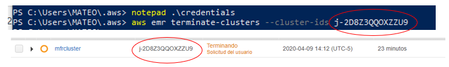
  
      
* Recreación/Clonación del cluster
  
  Interactivamente: 
  
   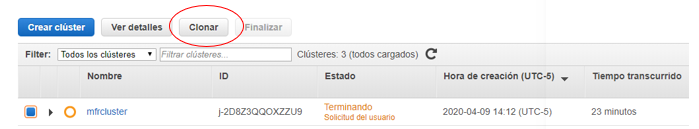
   
  Por línea de comandos:
  
     1.	Entramos a la información del cluster
     
     2.	Consultamos el comando de AWS CLI
    
    
    
     3.	Ejecutamos
  
    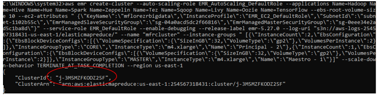  
      
    

  ## Habilitar entradas remotas
  
  * SSH
  
    Conexión mediante la herramienta putty:
  
    
  
    
  
  
  * HUE
  
    Interfaz para ingeniero de datos
 
    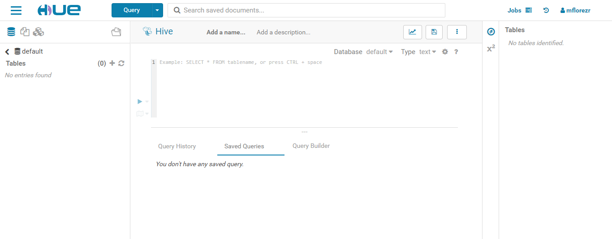
 
 ## GESTIÓN DE ARCHIVOS A HDFS Y S3
 
 * Desde HUE:
 
     1. A HDFS:
 
        Creamos los directorios y subimos los datasets.
  
        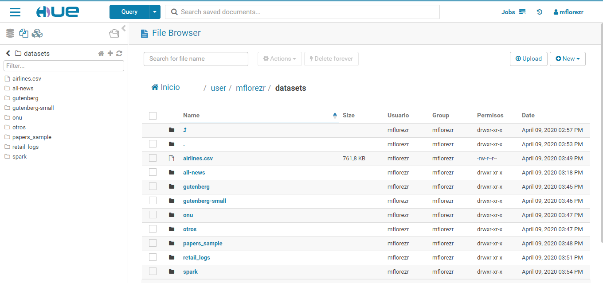
  
     2. A S3
  
        Nos ubicamos en nuestro bucket, o creamos uno nuevo
  
        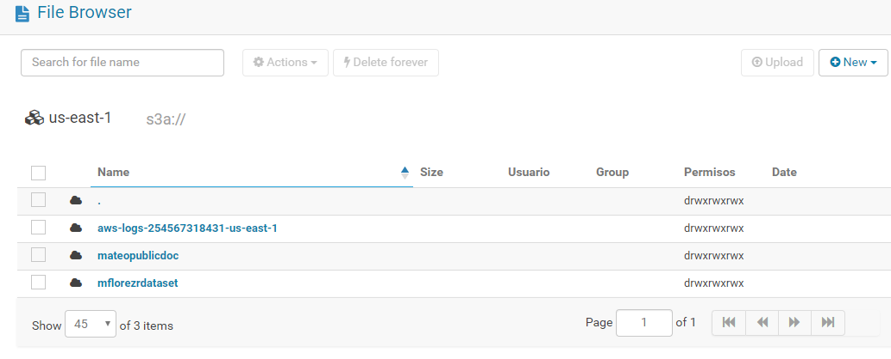
  
        Creamos los directorios y subimos los archivos.
  
        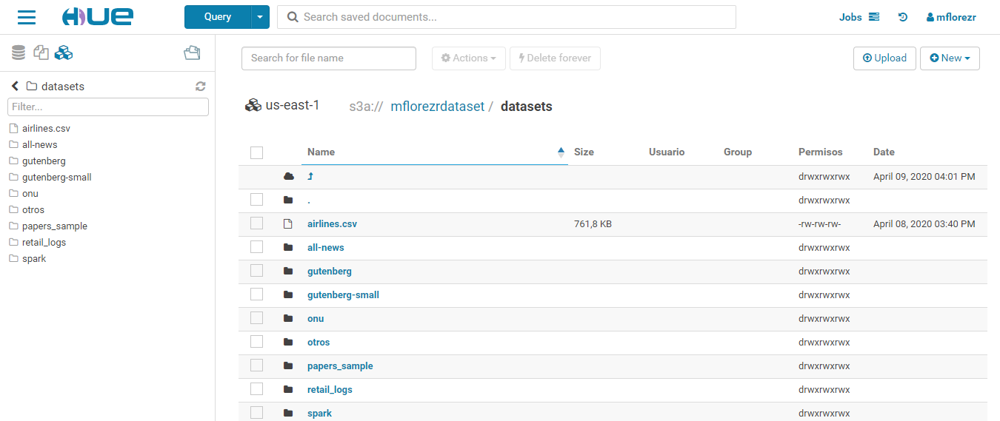
   
        [OPCIONAL] Crear un bucket nuevo desde HUE
  
        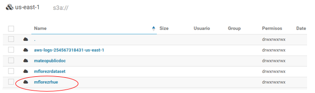
  
        Crear directorios y subir archivos
 
        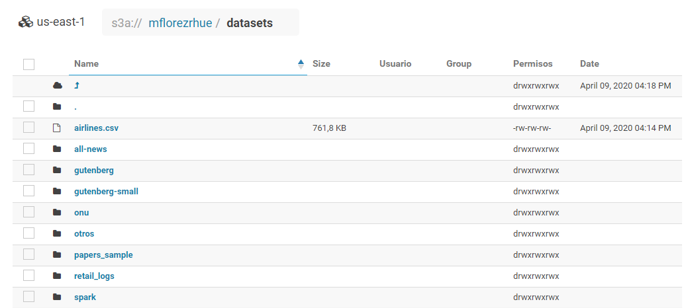
  
  
 * Desde Shell:
 
     1.	A HDFS
  
        Accedemos al nodo maestro a través de ssh por putty, debido a que los datasets aún no están en el nodo local debemos descargarlos. Ya que no existe el comando git, lo traemos desde HDFS(tambien se puede desde s3) teniendo en cuenta que los datasets ya se encuentran ahí.
  
        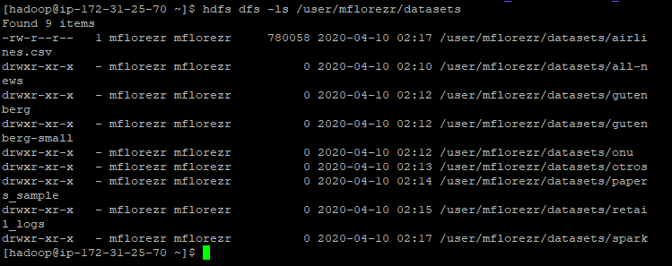
  
        Creamos un directorio y traemos todos los datasets a este.
  
        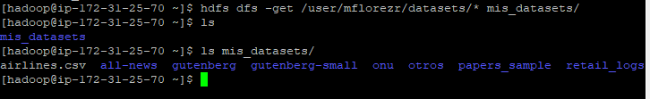
  
        Para subir desde Shell a HDFS lo que hacemos es crear otra carpeta en HDFS y subimos los archivos. (El proceso inverso).
  
        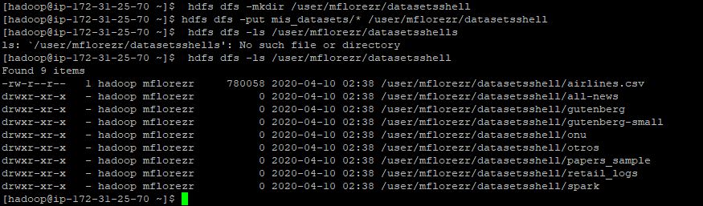
  
        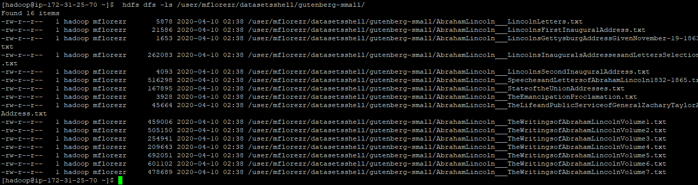
  
    2. A S3
  
        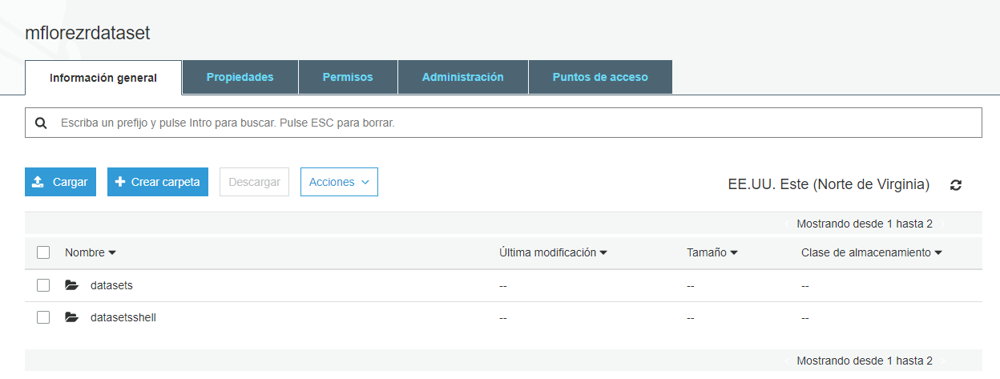
  
        Copiaremos los archivos locales al directorio “datasetsshell”. Podemos copiar un archivo por uno con el comando cp o podemos subir los directorios con sync.
  
        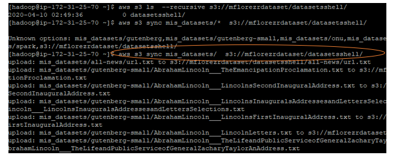
 
        Los archivos fueron copiados, podemos verificar por shell o de manera interactiva en la consola de AWS/S3:
 
        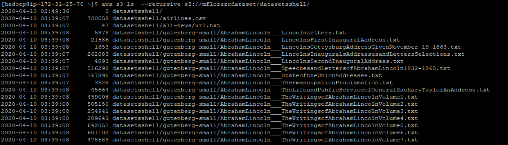
 
        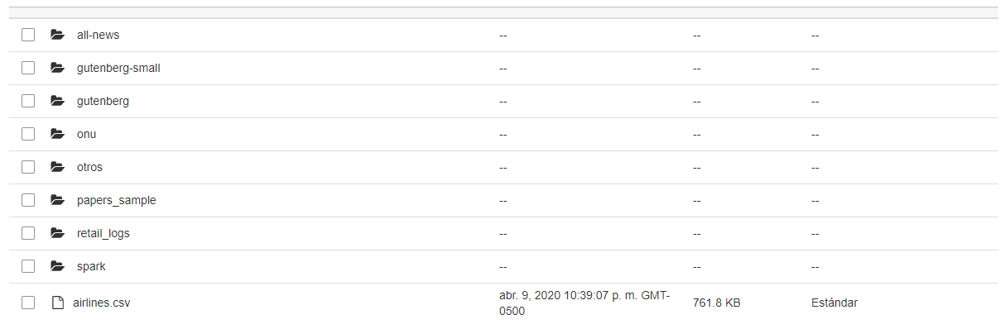
 
### 2. Gestion de archivos en HDFS Y S3
  
  * Copiar datasets desde Shell en la 192.168.10.116 hacia HDFS/DCA 
  
      Para este laboratorio podemos acceder al Shell desde Jupyter(https://jupyter116.dis.eafit.edu.co), desde Putty(Con la vpn y user-vpn@192.168.10.116 a través de ssh)  y desde PowerShell con el comando:
                      
        (local)$ ssh user-vpn@192.168.10.116.

      Para más facilidad haremos la copia de datos a través de Jupyter.  Ingresamos con usuario y contraseña de vpn, creamos una nueva terminal, en caso de no tener los datasets, clonamos el repositoro donde se encuentran los datasets. Luego creamos un directorio para guardar los datasets llamado “datasetsshell” y copiamos los datasets allí. 
      
      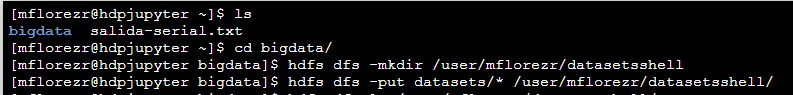
      
      Luego verificamos que si se hayan copiado:
      
      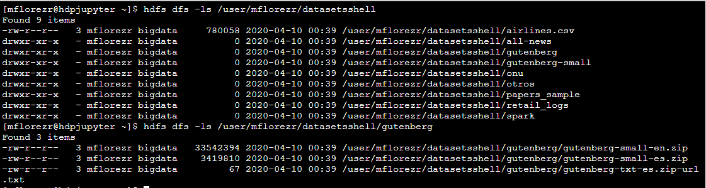
      
* Copiar datasets desde Shell en la 192.168.10.116 hacia S3/Amazon 
  
    Subiremos los datasets desde jupyter a el bucket “mflorezrdatasets” en el directorio datasetsjupyter:
    
     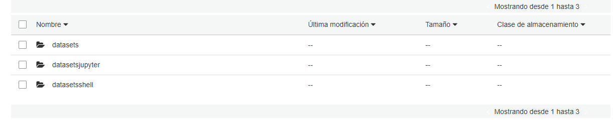
    
    Debido a que en el DCA no está instalado el AWS CLI, lo instalamos mediante el comando:
  
       pip install awscli
       
    Configuramos las credenciales de aws y copiamos entonces los documentos en s3:
    
    
    
    Por medio de este comando consultamos si se subieron correctamente los archivos:

    
    
    O de forma interactiva:
    
    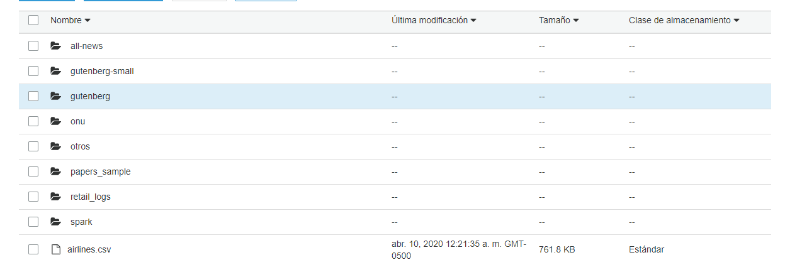
     
    Podemos ver entonces que los archivos fueron copiados en S3.
    
*	Copiar datasets desde Shell en su PC hacia S3/Amazon
    
    Actualizamos las credenciales de aws. Descargamos o clonamos el repositorio donde están los datasets a nuestro PC. 
    Copiaremos los archivos en el siguiente directorio del bucket “mflorezrdataset”
    
    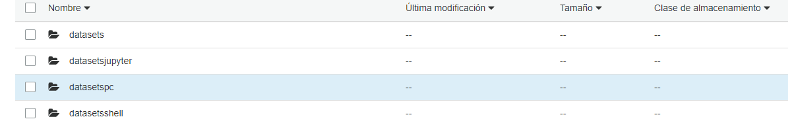
   
    A través del siguiente comando copiamos los archivos al bucket de s3. 
    
    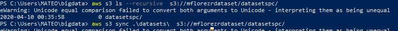
    
    Vemos en s3 que los archivos fueron copiados.
   
    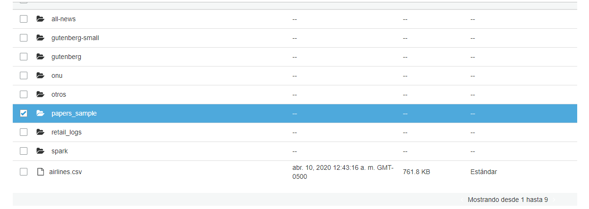
    
* Copiar datasets desde Browser via Ambari (192.168.10.116:8080) hacia HDFS/DCA 
  
    Ingresamos a ambari con el usuario y clave de la vpn:
    
    https://ambari116.dis.eafit.edu.co
    
    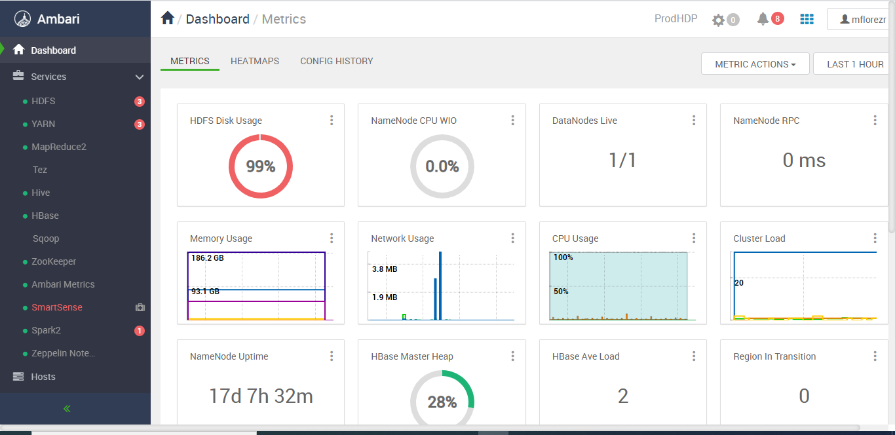
    
    Vamos a “Files View” , ubicamos la carpeta user y nuestro usuario, creamos un directorio llamado datasets, y subimos interactivamente los datasets.
    
    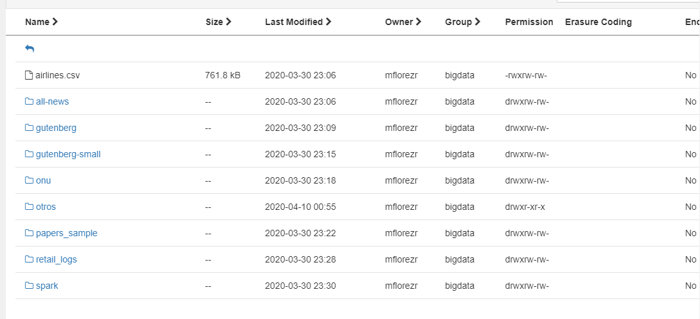
    
* Copiar datasets desde Browser AWS hacia S3/Amazon    

    Ingresamos a AWS Educate, vamos a la consola y buscamos S3, una vez allí creamos un nuevo bucket con acceso público.
    
    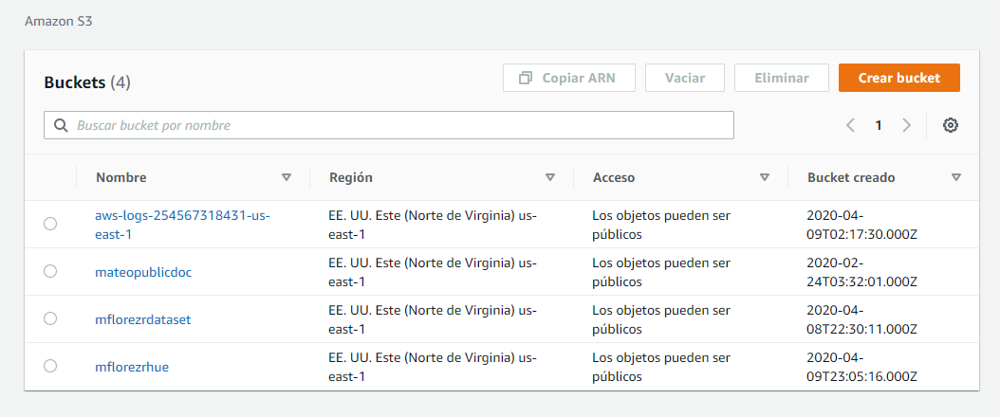
    
    Una vez creado el bucket llamado “mflorezrdataset”, creamos un directorio dentro de él llamado dataset, y subimos los datasets de nuestro computador arrastrándolos al directorio:

    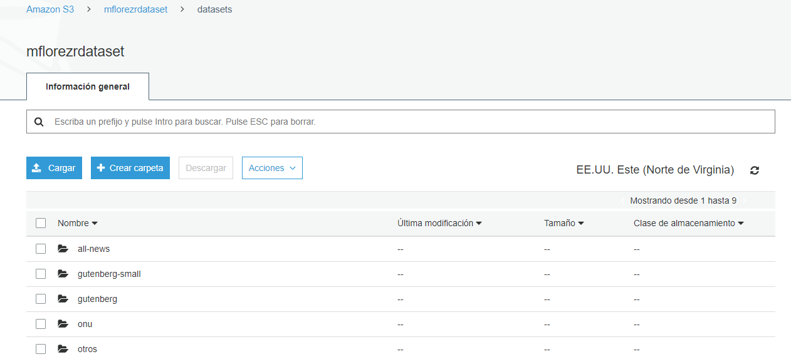
 
   
 ### 3. MAP/REDUCE
 
 * Local
 
   Wordcount en Python
   
   Accedemos a Jupyter por medio de powershell, clonamos el repositorio en caso de no tener los datasets. Y luego ejecutamos los pasos del laboratorio.
   
   Correr la versión serial / secuencial asumiendo todos los datos locales:
                    
        $ cd 02-mapreduce
        $ python wordcount-local.py /datasets/gutenberg-small/*.txt > salida-serial.txt 
        $ more salida-serial.txt

   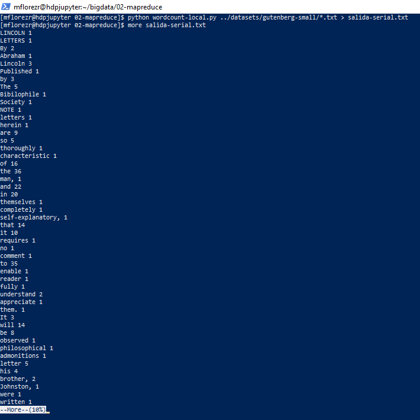
  
   Despues de descargar la libreria de Mrjob para acceder a los recursos de Map/Reduce en Hadoop, se prueba mrjob python local:
   
        $ cd 02-mapreduce
        $ python wordcount-mr.py ../datasets/gutenberg-small/*.txt
        
   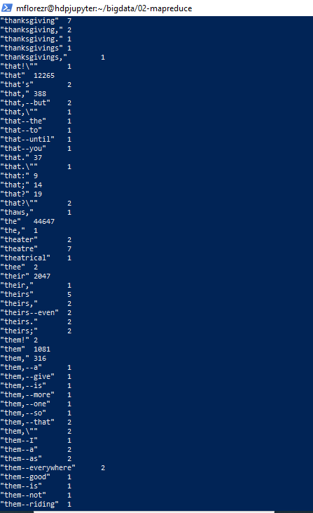
    

### 4. Ejercicio Map/Reduce con MRjob

  * ver: [MRjob exercise](mrjob)
  
### 5. Gestion de datos HIVE/SQOOP

## HIVE

   * Crear la base de datos ‘mydb’
   	 
     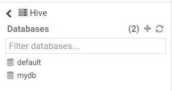

   * Crear la tabla ‘hdi’ dentro de la base de datos 
   
     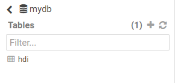

   * Cargar datos a la tabla:
     
     copiando datos directamente hacia hdfs:///user/hive/warehouse/mydb.db/hdi
     	 
     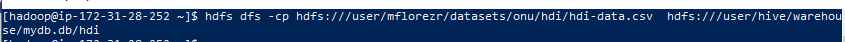
	   
     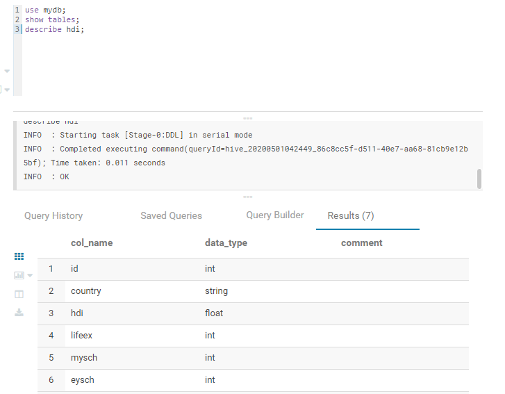
	  
   * Consultas:
      
      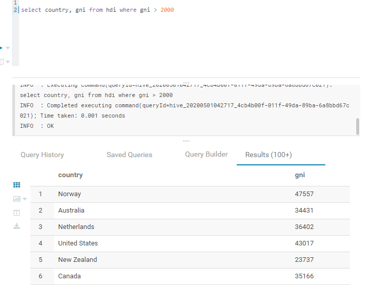
      
      Join con hive:
      
      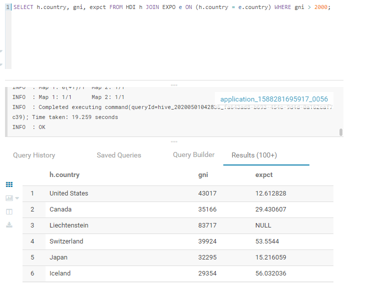
     
   * WordCount en hive
       
       Ordenado por palabra:
       
       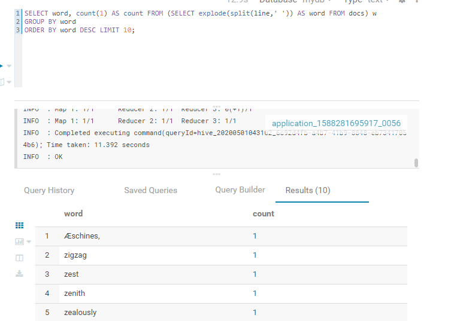
       
       Ordenado por frecuencia mayor a menor
       
       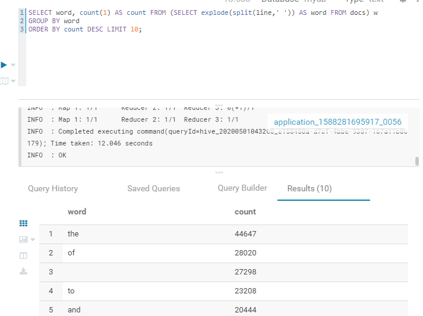
	
## SQOOP

   * Gestion de datos y tablas ‘curso’ y ‘retail_db’
   
     Datos en SQL:

     Comando para cargar los scripts de datos:

     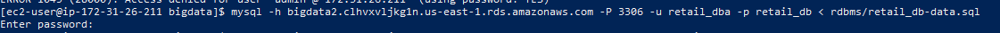

     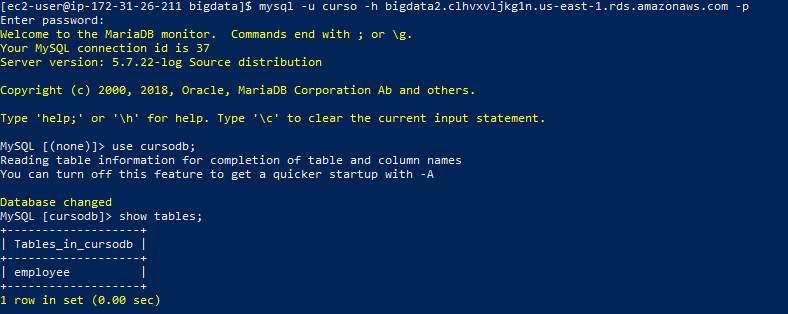
 
     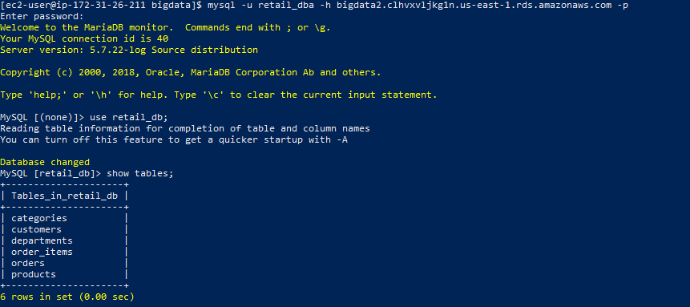
   
   * Por HUE:
   
     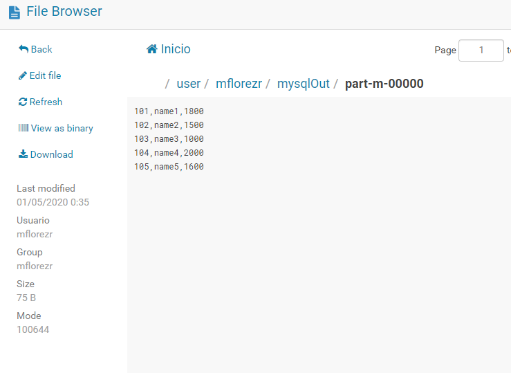
     
   * Comandos Sqoop desde CLI
   
     Datos transferidos a HDFS y listados:
     
     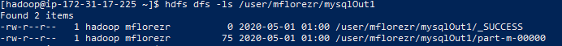
     
     Crear tabla hive e importar datos desde mysql
      
     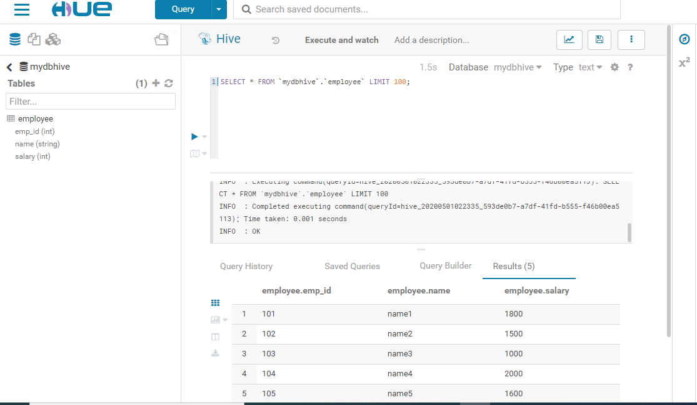
     
     Traer todas las tablas de mysql a hive via hdfs 
     
     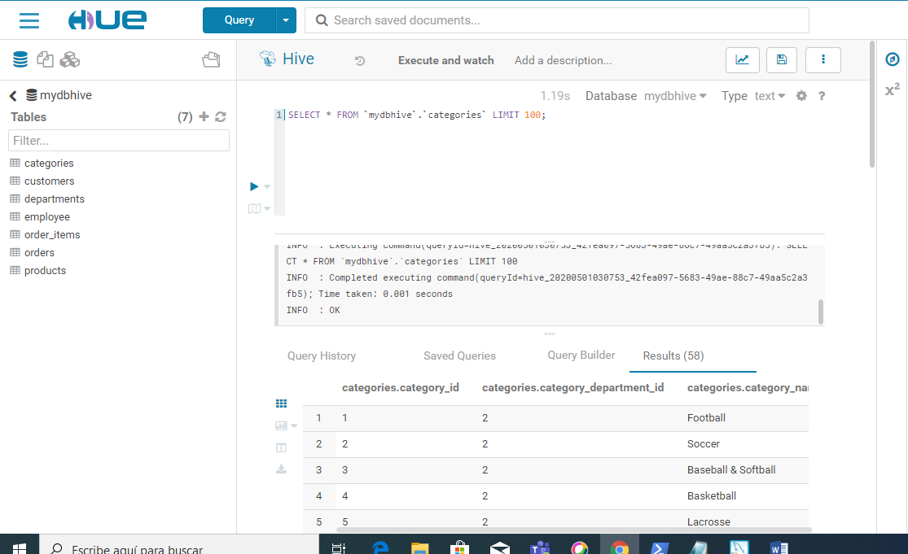
     
     Consulta en MYSQL
     
     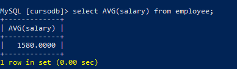
     
     Consulta en HIVE
     
     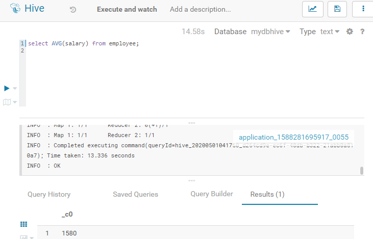
      
### 6. Caso de estudio Retail_db

   * Ingesta de datos:
   	
     Importar los datos de Mysql a HIVE via sqoop
     
     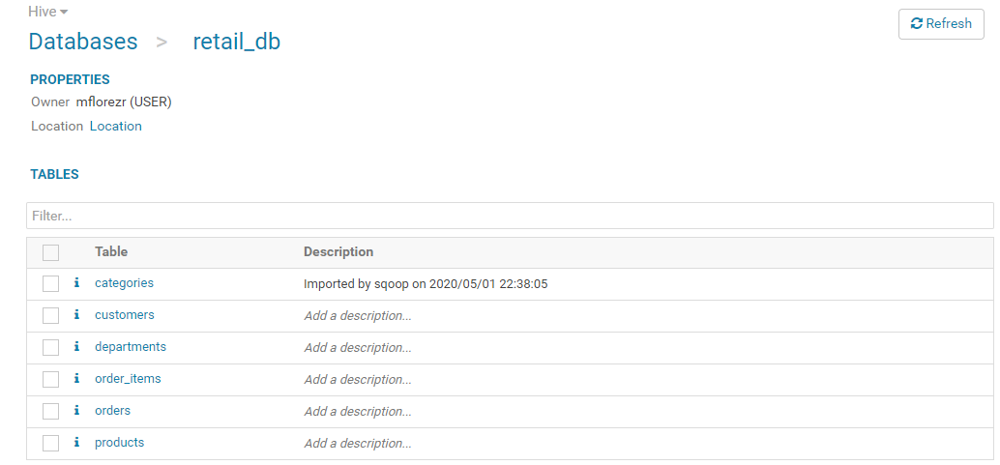
     
   * Procesar los datos
     
     1. Categorías más populares de productos
     
     
       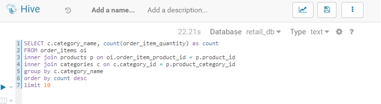
     
       Resultado:
     
       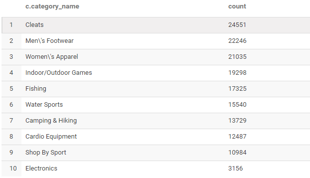
     
     2. Top 10 de los productos que generan más ganancia
     
       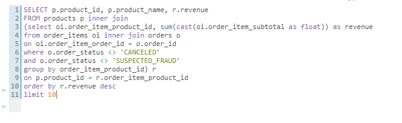
     
       Resultado:
     
       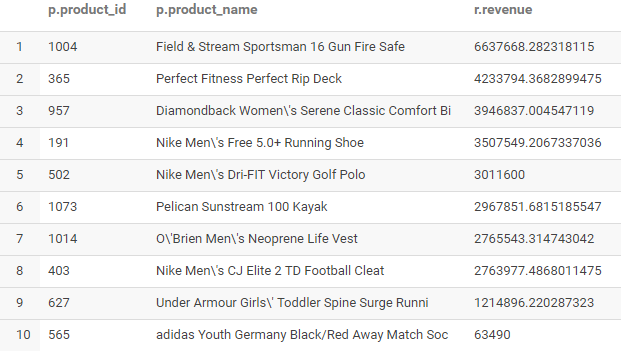
     
   * Pregunta de negocio
   
     ¿Son los productos más visitados los que hacen parte de los de mayor rentabilidad? 
     Como podemos ver los productos mas vistos o populares no son los mismos que generan más ganancia a la empresa.
     
   * Ingestar, almacenar, y procesar logs de eventos de servidores web
   
     * Subir los logs al HDFS
    
     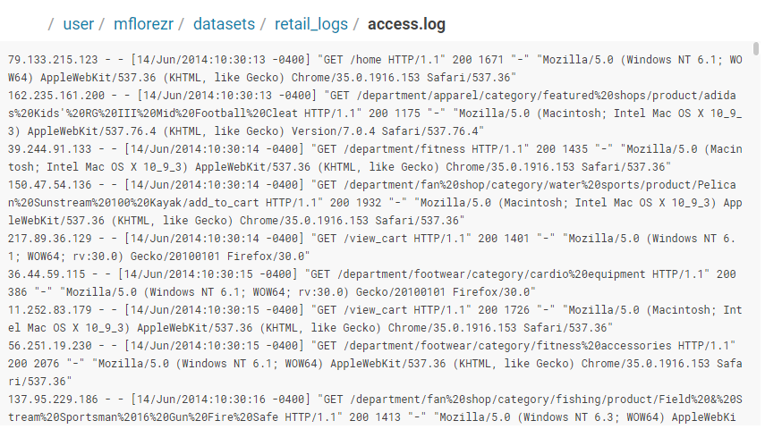
     
     * Crear tabla y almacenar los logs
     
     
     
     * Crear directorio para tabla externa con ETL
     
     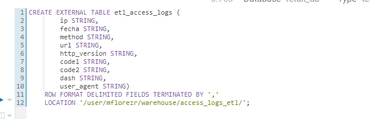
     
     * Procesar ETL:
	
      1. Mostrar los productos más visitados 
      
      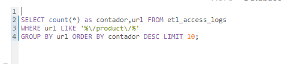
      
      Resultados:
      
      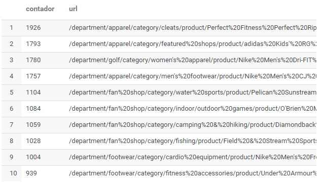
      
     * Pregunta de negocio
     
     ¿Son los productos más visitados en el sitio web los más vendidos?
     
     Como podemos ver en los resultados de los logs los productos mas visitados si son los que generan mas ganancia y por ende mas rentabilidad para la empresa.

 

     

     
     

   
   
   

	
	

    

  
  
  

