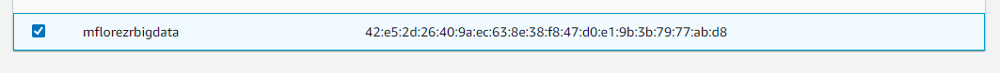
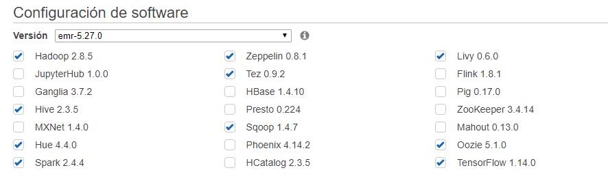
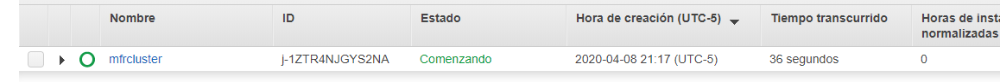
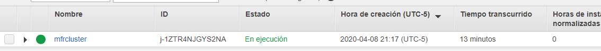
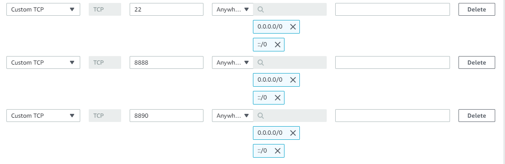

# Laboratorio BigData
# STO263 Tópicos especiales en telemática 

# Mateo Flórez Restrepo
# 2020-1

### Contenidos del laboratorio
* Creacion y gestion de archivos en EMR

* Gestion de archivos en HDFS Y S3

* Map/Reduce 

* Ejercicio Map/ Reduce con MRJob

# Bitácora

## 1. Creacion y gestión de archivos en EMR 

* Creación del cluster

  Ingresamos a nuestra cuenta AWS Educate e ingresamos a la consola de AWS.
  
  Creamos una KeyPair que ira asociada con el cluster
  
   

  Cluster por método interactivo:
  
  Buscamos a EMR en la consola, y creamos un nuevo cluster.
  
  Recursos:
  
   
  
  Cluster creado:
  
  
  
   
  
  Se agrega las reglas para los puertos pertenecientes a Hue(8888) a Zeppelin(8890) y SSH(22)
  
   
  
  
  
  

