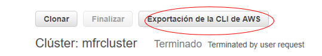

# Laboratorio BigData
# STO263 Tópicos especiales en telemática 

# Mateo Flórez Restrepo
# 2020-1

### Contenidos del laboratorio
* Creacion y gestion de archivos en EMR

* Gestion de archivos en HDFS Y S3

* Map/Reduce 

* Ejercicio Map/ Reduce con MRJob

# Bitácora

### 1. Creacion y gestión de archivos en EMR 

* Creación del cluster

  Ingresamos a nuestra cuenta AWS Educate e ingresamos a la consola de AWS.
  
  Creamos una KeyPair que ira asociada con el cluster
  
   

  Cluster por método interactivo:
  
  Buscamos a EMR en la consola, y creamos un nuevo cluster.
  
  Recursos:
  
   
  
  Cluster creado:
  

  
   
  
  Se agrega las reglas para los puertos pertenecientes a Hue(8888) a Zeppelin(8890) y SSH(22)
  
   
  
  Luego vamos a la seccion de Bloqueo de acceso publico y agregamos el rango de puertos de usaremos para este laboratorio.
  
   
  
  ## Scripts importantes para creacion y destruccion de clusters
  
   

* Destrucción de un cluster
  
  Interactivamente:
  
  
  
  Por línea de comandos:
  
    1.	Actualizamos las credenciales de AWS CLI
    
    2.	Ubico el id del cluster y lo destruyo con el siguiente comando
      
   
  
      
* Recreación/Clonación del cluster
  
  Interactivamente: 
  
   
   
  Por línea de comandos:
  
     1.	Entramos a la información del cluster
     
     2.	Consultamos el comando de AWS CLI
    
    
    
     3.	Ejecutamos
  
      
      
    

  ## Habilitar entradas remotas
  
  * SSH
  
  Conexión mediante la herramienta putty:
  
  
  
  
  
  
  * HUE
  
 Interfaz para ingeniero de datos
 
 
 
 ## GESTIÓN DE ARCHIVOS A HDFS Y S3
 
 * Desde HUE:
 
  1.	A HDFS:
 
  Creamos los directorios y subimos los datasets.
  
  
  
  2. A S3
  
  Nos ubicamos en nuestro bucket, o creamos uno nuevo
  
  
  
  Creamos los directorios y subimos los archivos.
  
   
   
  [OPCIONAL] Crear un bucket nuevo desde HUE
  
  
  
  Crear directorios y subir archivos
 
  
  
  
 * Desde Shell:

  1.	A HDFS
  
  Accedemos al nodo maestro a través de ssh por putty, debido a que los datasets aún no están en el nodo local debemos descargarlos. Ya que no existe el comando git, lo traemos desde HDFS(tambien se puede desde s3) teniendo en cuenta que los datasets ya se encuentran ahí.
  
  
  
  Creamos un directorio y traemos todos los datasets a este.
  
  
  
  Para subir desde Shell a HDFS lo que hacemos es crear otra carpeta en HDFS y subimos los archivos. (El proceso inverso).
  
  
  
  
  
 2. A S3
  
  
  
  Copiaremos los archivos locales al directorio “datasetsshell”. Podemos copiar un archivo por uno con el comando cp o podemos subir los directorios con sync.
  
  
 
 Los archivos fueron copiados, podemos verificar por shell o de manera interactiva en la consola de AWS/S3:
 
 
 
 
 
 
  
  
  
  
  

 
   
  
 
 
  

  
  
  
  
  

