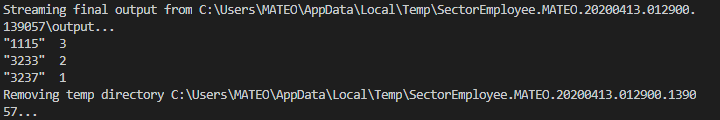

# LABORATORIO MRJOB
# Mateo Florez Restrepo

## Problema 

  1. Se tiene un conjunto de datos, que representan el salario anual de los empleados formales en Colombia por sector económico, según la DIAN.
  
          idemp,sececon,salary,year
      
          3233,1234,35000,1960
          3233,5434,36000,1961
          1115,3432,34000,1980
          3233,1234,40000,1965
          1115,1212,77000,1980
          1115,1412,76000,1981
          1116,1412,76000,1982

* Realizar un programa en Map/Reduce, con hadoop en Python o Java, que permita calcular:

  1. El salario promedio por Sector Económico (SE)
  2. El salario promedio por Empleado
  3. Número de SE por Empleado que ha tenido a lo largo de la estadística
  
## Solucion

   Antes de probarlos se debe descargar la libreria de mrjob para usar los recursos 
              
       $ pip install mrjob

   1. El salario promedio por Sector Económico (SE)
      
      El programa creado para resolver esta pregunta es : [AnnualSalary.py](AnnualSalary.py)
      
      Comando para probarlo con un dataset local [datasets](../datasets/):
      
          $ python AnnualSalary.py ../datasets/dataempleados.csv
          
          
      
          
      Para guardar los resultados en un archivo [Salario promedio por sector.txt](Salario%20promedio%20por%20sector.txt)
      
          $ python AnnualSalary.py ../datasets/dataempleados.csv > Salario promedio por sector.txt
   
   2. El salario promedio por Empleado
      
      El programa creado para resolver esta pregunta es : [AnnualSalaryEmployee.py](AnnualSalaryEmployee.py)
      
      Comando para probarlo con un dataset local [datasets](../datasets/):
      
          $ python AnnualSalaryEmployee.py ../datasets/dataempleados.csv
          
          
      
          
      Para guardar los resultados en un archivo [Salario promedio por empleado.txt](Salario%20promedio%20por%20empleado.txt)
      
          $ python AnnualSalaryEmployee.py ../datasets/dataempleados.csv > Salario promedio por empleado.txt
  
  
   3. Número de SE por Empleado que ha tenido a lo largo de la estadística
      
      El programa creado para resolver esta pregunta es : [SectorEmployee.py](SectorEmployee.py)
      
      Comando para probarlo con un dataset local [datasets](../datasets/):
      
          $ python SectorEmployee.py ../datasets/dataempleados.csv
          
          
      
          
      Para guardar los resultados en un archivo [Numero de sectores por empleado.txt](Numero%20de%20sectores%20por%20empleado.txt)
      
          $ python SectorEmployee.py ../datasets/dataempleados.csv > Numero de sectores por empleado.txt 
      
      
   

  
